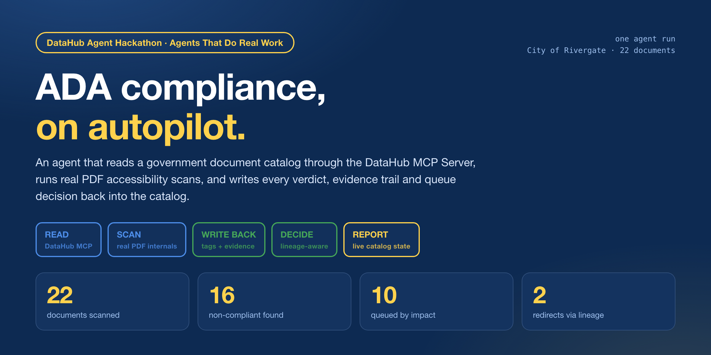
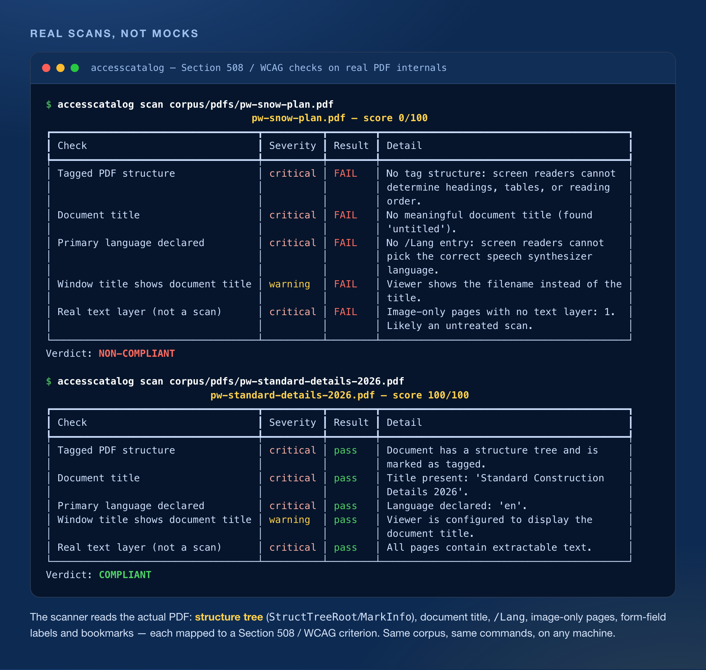
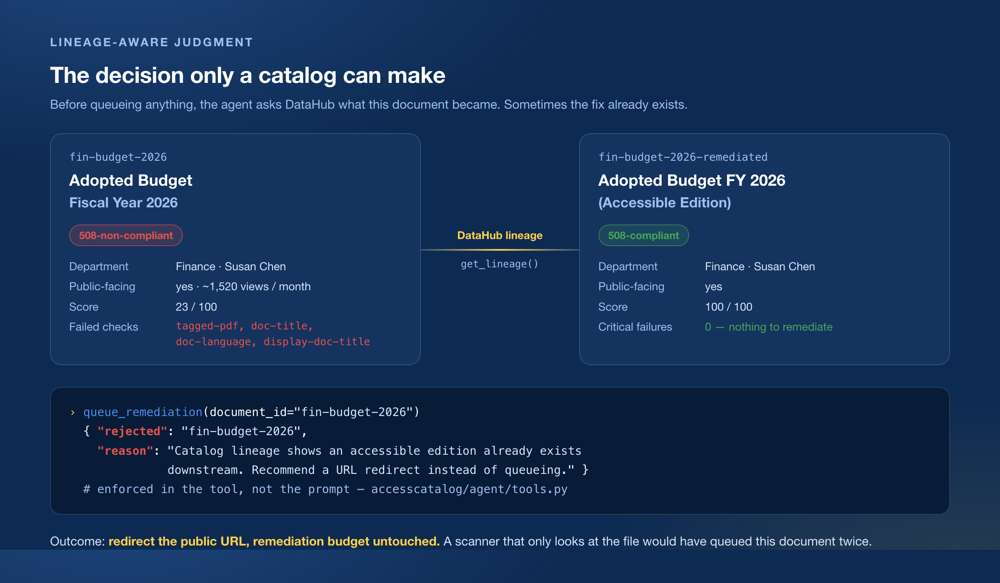
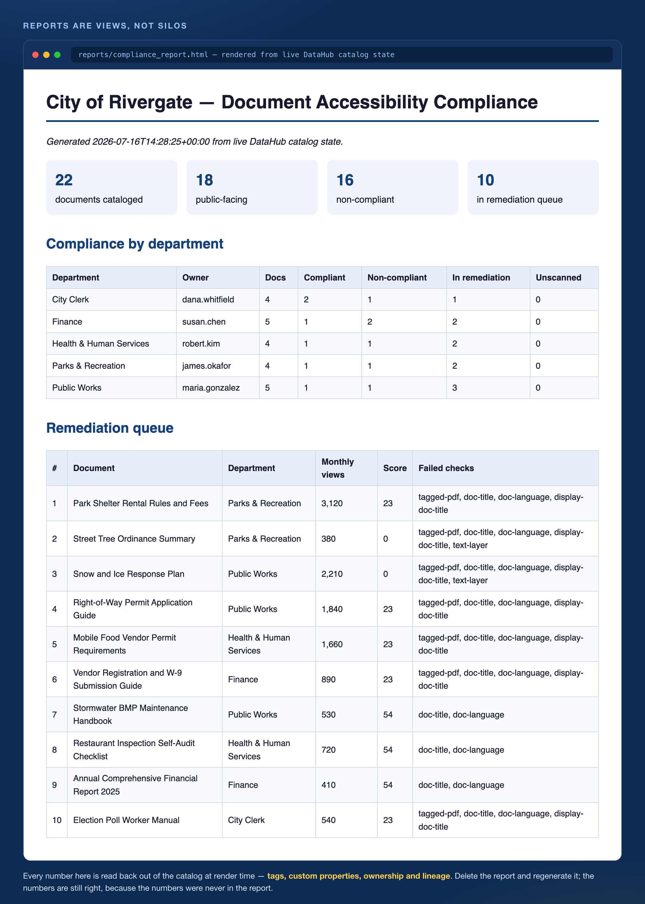
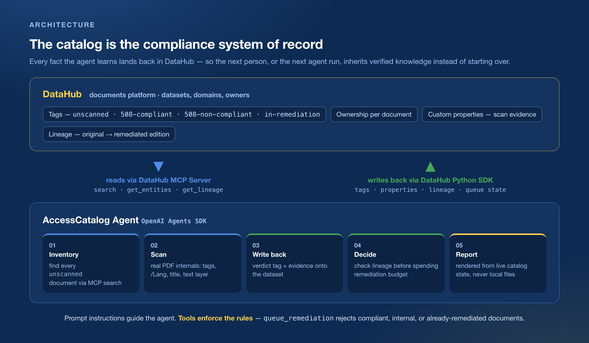

# AccessCatalog Agent



An agent that makes a government's document catalog **tell the truth about its own accessibility**.
It reads the catalog through the DataHub MCP Server, runs real Section 508 / WCAG scans against
actual PDF internals, and writes every verdict, every piece of evidence, and every queue decision
back into DataHub — so the next person, or the next agent run, inherits verified knowledge instead
of starting over.

Built for the **DataHub Agent Hackathon** — *Agents That Do Real Work* track.
**[→ Project page](https://imeunk89.github.io/accesscatalog-agent/)** · **[→ A report the agent actually produced](https://imeunk89.github.io/accesscatalog-agent/report.html)**

[](LICENSE) [](pyproject.toml) [](https://datahub.com) [](https://docs.datahub.com/docs/features/feature-guides/mcp) [](https://openai.github.io/openai-agents-python/)

> **Data & scope:** the demo runs against a **synthetic** 22-PDF corpus for a fictional
> "City of Rivergate," committed to this repo. The corpus is synthetic; the *scans are not* —
> every verdict below comes from parsing real PDF structure with `pikepdf`/`pypdf`, and the
> compliant samples are genuinely tagged PDF/UA files produced by WeasyPrint. No real agency's
> documents are used.

---

## The problem

Public agencies are legally required to make their documents accessible — Section 508 for US
federal agencies, and under the DOJ's [ADA Title II web rule](https://www.ada.gov/resources/2024-03-08-web-rule/)
state & local governments must meet WCAG 2.1 AA, with compliance deadlines from **April 2027**.
The DOJ [extended those deadlines by a year in April 2026](https://www.federalregister.gov/documents/2026/04/20/2026-07663/extension-of-compliance-dates-for-nondiscrimination-on-the-basis-of-disability-accessibility-of-web)
for one stated reason: entities aren't ready and technical solutions have lagged.

Meanwhile a mid-size city publishes thousands of PDFs across dozens of departments, and nobody
can answer:

- *Which of our public-facing documents are still inaccessible?*
- *Which department owns them?*
- *What should we remediate first?*
- *Has this document already been remediated somewhere?*

Spreadsheet trackers rot. Accessibility scans get run once and forgotten. The knowledge lives in
nobody's head. **The catalog is the only place that survives staff turnover — so the compliance
answer belongs there.**

---

## The demo

```bash
./scripts/demo.sh          # ingest → agent → reports, against a local DataHub
```

### 1. Real scans, not mocks

Most "accessibility dashboards" show a status somebody typed in. This one opens the file. The
scanner inspects tag structure (`StructTreeRoot`/`MarkInfo`), the document title, `/Lang`,
image-only pages, form-field labels and bookmarks — **7 checks, each mapped to a Section 508 /
WCAG criterion**, with a severity that decides the verdict. (Two of the seven only fire when the
document actually has form fields or is long enough to need bookmarks, which is why the runs below
show five.) An untreated scan of the city's snow plan, then a genuinely tagged PDF/UA file:



### 2. The decision only a catalog can make

Before queueing anything, the agent asks DataHub what the document *became*. `fin-budget-2026` is
non-compliant and gets 1,520 views a month — an obvious remediation candidate. But lineage shows
an accessible edition already exists downstream, so the right answer isn't "spend a week fixing
it," it's "redirect the public URL." The `queue_remediation` tool **refuses the call itself** —
the rule is enforced in code, not hoped for in a prompt.



Across one run the guardrail caught **2** such documents. It also rejects compliant documents,
internal-only documents, and anything not yet scanned — a misjudged tool call fails loudly instead
of quietly polluting the catalog.

### 3. The report is a view, not a silo

The compliance report isn't a file the agent maintains — it's a query. Every KPI, every
department row, every queue position is read back out of DataHub at render time, so the document
a director forwards to legal and the state of the catalog can't disagree with each other. The
same run also emits Markdown, for people who'd rather diff it.



Full versions: [`examples/compliance_report.md`](examples/compliance_report.md) ·
[`examples/compliance_report.html`](examples/compliance_report.html) ·
[live copy on GitHub Pages](https://imeunk89.github.io/accesscatalog-agent/report.html)

---

## What's actually running

One full agent pass over the sample city, against a local DataHub quickstart:

| | |
|---|---|
| Documents cataloged as DataHub datasets | **22** (18 public-facing) |
| Documents scanned this run | **22 / 22** |
| Verdicts written back to the catalog | **6** compliant · **16** non-compliant |
| Remediation queue built by the agent | **10** documents, ranked by monthly views, then severity |
| Queue attempts blocked by the lineage guardrail | **2** → redirect recommended instead |
| Internal-only documents correctly kept out of the queue | **4** |
| Accessibility checks per document | **7**, mapped to Section 508 / WCAG |
| DataHub MCP tools used | `search` · `get_entities` · `get_lineage` — **live** |
| Write-back path | DataHub Python SDK — tags, properties, lineage — **live** |
| Agent tools | `scan_document` · `queue_remediation` · `get_queue_status` — **live** |

Sample outputs from that exact run are committed under [`examples/`](examples/), including the
agent's own [executive summary](examples/agent_summary.md) and the
[remediation queue](examples/remediation_queue.json).

---

## How it works (pipeline)

1. **Ingest** the corpus into DataHub as datasets on a custom `documents` platform — one dataset
   per PDF, with department domains, real owners, traffic metadata, and lineage edges from each
   original to its remediated edition. Everything starts tagged `unscanned`.
2. **Inventory**: the agent calls the MCP `search` tool for `tags:unscanned` and batches
   `get_entities` to pull each document's custom properties.
3. **Scan**: for each document, `scan_document` opens the actual PDF and runs the 508/WCAG checks.
4. **Write back**: the verdict becomes a tag (`508-compliant` / `508-non-compliant`) and the
   evidence — score, failed checks, timestamp, scanner version — becomes custom properties on the
   dataset. The catalog is now the source of truth.
5. **Check lineage**: before queueing, `get_lineage` answers whether an accessible edition already
   exists downstream.
6. **Queue**: `queue_remediation` ranks by public traffic and failure severity, flips the tag to
   `in-remediation`, and **rejects** anything compliant, internal, unscanned, or already remediated.
7. **Report**: Markdown + HTML compliance reports are rendered from live catalog state.

## Architecture



## DataHub features used

- **Datasets on a custom platform** — **live.** Documents are first-class catalog entities, not
  rows in a side table. See [`accesscatalog/ingest/pipeline.py`](accesscatalog/ingest/pipeline.py).
- **Tags as compliance state** — **live.** `unscanned` → `508-compliant` / `508-non-compliant` /
  `in-remediation`. The tag *is* the status; there is no second system to keep in sync.
- **Custom properties as evidence** — **live.** Score, failed checks, scan timestamp and scanner
  version ride along with the entity, so any verdict can be audited later.
- **Domains + Ownership** — **live.** Every document has a department domain and a named owner, so
  "who fixes this?" is answerable without asking around.
- **Lineage** — **live.** Original → remediated edition. This is what turns a scanner into a
  decision-maker: [`accesscatalog/agent/tools.py`](accesscatalog/agent/tools.py).
- **DataHub MCP Server** — **live.** The agent's read path is `search`, `get_entities` and
  `get_lineage` over MCP; it never queries a local copy of the catalog.
- **DataHub Python SDK** — **live.** The write path. Write failures are surfaced to the model
  honestly instead of being swallowed, so a broken run reports itself as broken.

---

## Quick start

Prereqs: Docker (e.g. [OrbStack](https://orbstack.dev)), [uv](https://docs.astral.sh/uv/), and an
OpenAI API key. The 22-PDF sample corpus is **pre-generated and committed** — nothing else to
install.

```bash
git clone https://github.com/imeunk89/accesscatalog-agent && cd accesscatalog-agent

# 1. Python env + deps
uv venv --python 3.11 && source .venv/bin/activate
uv pip install -e . mcp-server-datahub

# 2. Local DataHub (takes a few minutes on first run)
datahub docker quickstart
# UI: http://localhost:9002  (user/pass: datahub/datahub)

# 3. Configure the agent
cp .env.example .env   # add your OPENAI_API_KEY

# 4. Run everything: ingest -> agent -> reports
./scripts/demo.sh
```

You can watch the agent work in the DataHub UI: search `tags:unscanned`, refresh, and see
documents flip to `508-non-compliant` / `508-compliant` / `in-remediation` in real time, with the
scan evidence sitting in each dataset's properties.

> Want to regenerate the corpus from scratch? `brew install weasyprint`, then
> `uv pip install -e '.[corpus]' && python scripts/generate_corpus.py`
> (WeasyPrint is only needed for corpus generation — it produces genuinely tagged PDF/UA files, so
> the "compliant" samples are real, not mocked).

## CLI

| Command | What it does |
|---|---|
| `accesscatalog ingest` | Register the corpus in DataHub as unscanned inventory |
| `accesscatalog agent` | Full compliance pass: scan → write back → prioritize → queue |
| `accesscatalog report` | Markdown + HTML compliance reports from live catalog state |
| `accesscatalog status` | Per-department compliance table in the terminal |
| `accesscatalog scan <pdf>` | Scan any single PDF locally (no DataHub, no API key) |

`accesscatalog scan` is the fastest way to convince yourself the scanner is real — it needs
neither Docker nor an OpenAI key:

```bash
accesscatalog scan corpus/pdfs/pw-snow-plan.pdf
```

## Repository layout

```
accesscatalog/
  scanner/   # real PDF accessibility checks (Section 508 / WCAG mapped)
  ingest/    # DataHub ingestion + write-back (tags, evidence, lineage)
  agent/     # OpenAI Agents SDK runner + DataHub MCP + guardrailed tools
  report/    # compliance reports rendered from live catalog state
corpus/      # synthetic City of Rivergate PDF corpus + manifest
examples/    # sample outputs from a real agent run
docs/img/    # README figures
scripts/     # corpus generator, demo script, figure renderer
```

## Troubleshooting

- **`Connection refused` on localhost:8080** — Docker (OrbStack) isn't running or the DataHub
  containers stopped. Start Docker, then re-run `datahub docker quickstart` (idempotent; it
  restarts existing containers) and wait until `curl -sf http://localhost:8080/health` succeeds.
- **Agent reports write-back failures** — same cause; the agent's tools surface DataHub write
  errors honestly instead of pretending they landed. Restore DataHub and re-run
  `accesscatalog agent`.
- **Re-running from scratch** — `accesscatalog ingest` resets every document to the `unscanned`
  baseline (tags, properties and lineage are re-emitted).
- **`accesscatalog: command not found`** — the venv isn't active. `source .venv/bin/activate`, or
  call it as `python -m accesscatalog.cli`.

## Regenerating the README figures

Every image in `docs/img/` is built from source in [`scripts/figures/`](scripts/figures/):

```bash
./scripts/render_figures.sh
```

The terminal figure re-runs the real scanner and the report figure screenshots the real generated
HTML, so the images can never drift from what the code actually does.

## Tech

DataHub (quickstart, Python SDK, MCP Server) · OpenAI Agents SDK · pikepdf / pypdf ·
WeasyPrint (PDF/UA corpus generation) · Typer + Rich

## License

Apache 2.0 — see [LICENSE](LICENSE).
